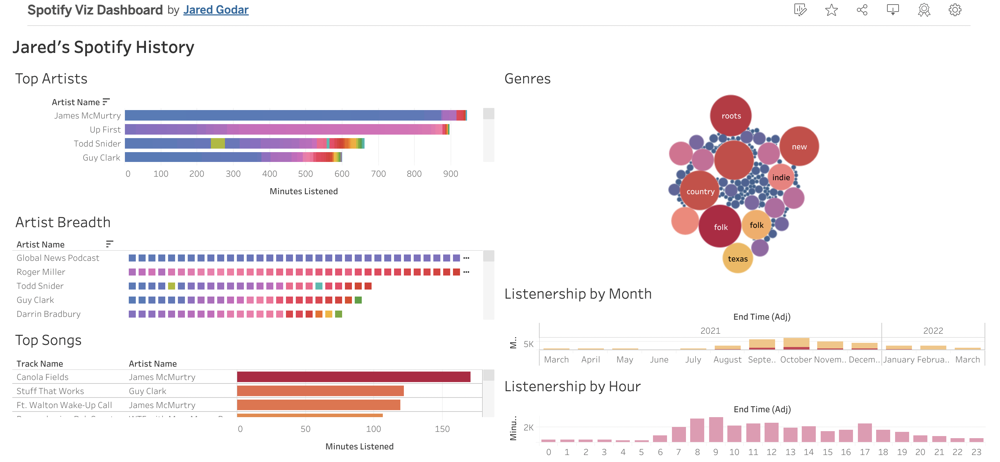

# Visualizing Personal Spotify Data with Python and Tableau

Read an [interesting article](https://towardsdatascience.com/visualizing-spotify-data-with-python-tableau-687f2f528cdd) on getting your listership data from Spotify and playing around with it.

## What?

- Get listening data from spotify
- Use Spotify API to get genre information
- Combine and clean up data in Python
- Export CSV
- Visualize in Tableu

## So What?

- Opportunity to practice data science pipeline with subject matter of interest to me
- Tableau practice

## Steps to reproduce

- [x] Read REARME.md
- [ ] Request data from Spotify [here](https://www.spotify.com/us/account/privacy/). It'll take a couple days until this is ready.
- [ ] Fork and download this repository.
- [ ] Move your downloaded Spotify Data into the repository.
- [ ] Check `requirements.txt1. Make virtual environment if necessary. (Not too many requirements for this project).
- [ ] Make an `env.py` file with your Spotify `CLIENT_ID` and `CLIENT_SECRET`. Be sure to add this file to your `.gitignore`. If you need a Spotify for Developers account to get these, you can [get one here](https://developer.spotify.com/dashboard/).
- [ ] Run Notebook
- [ ] Use exported `.csv` files in Tableau. 

## Results

### Dashboard Preview

### [Link to live Dashboard](https://public.tableau.com/app/profile/jared.godar/viz/SpotifyVizDashboard/PremiumDashboard?publish=yes)